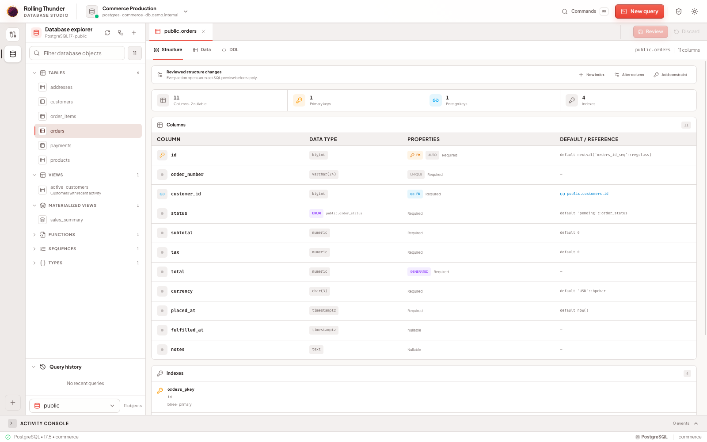
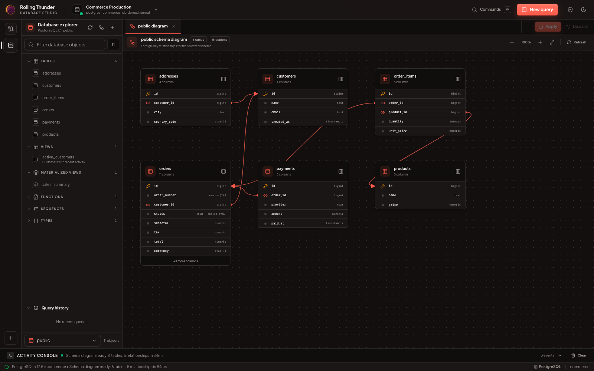

<div align="center">
  <a href="https://github.com/yudhasubki/rollingthunder/">
    
  </a>
</div>

<h1 align="center">Rolling Thunder</h1>

<p align="center">
  A focused, cross-platform database studio for exploring schemas, editing data, and running SQL
  without leaving the desktop.
</p>

<p align="center">
  Built with Go, Wails, Svelte 5, and Monaco Editor.
</p>

<p align="center">
  
</p>

<p align="center">
  <sub>Inspect tables, keys, native types, relations, and indexes without losing database context.</sub>
</p>

> [!WARNING]
> Rolling Thunder is under active development. Keep independent backups before using structural or
> destructive workflows against production-critical databases.

## What works today

### Connections

- Save and edit reusable connection profiles.
- Keep passwords in macOS Keychain, Windows Credential Manager, or Linux Secret Service instead of
  profile JSON.
- Keep multiple database sessions open and switch between them.
- Organize profiles with folders and tags, then search the complete profile list.
- Classify profiles as Unclassified, Development, Staging, or Production. Colors are derived from
  that operational meaning instead of being arbitrary profile decoration.
- Choose read-write or read-only access per profile; newly classified Production profiles default
  to read-only. This application guardrail complements rather than replaces database-side
  least-privilege roles.
- Configure TLS modes for PostgreSQL, MySQL/MariaDB, Oracle, and SQL Server. PostgreSQL,
  MySQL/MariaDB, and Oracle also accept client-certificate settings.
- Connect to Oracle through a direct endpoint or an explicitly selected `tnsnames.ora` alias, and
  use `ewallet.p12` or auto-login `cwallet.sso` Wallet directories for TCPS with `require` or
  hostname-verified `verify-full` TLS.
- Authenticate to SQL Server with a SQL login, the current Windows identity, Microsoft Entra
  Default, Entra username/password, a service principal, managed identity, or the current Azure CLI
  session. Passwords and client secrets remain in the operating-system credential store.
- Route direct network endpoints through an SSH tunnel using an SSH agent, private key, or password.
  Host keys must match a known-hosts entry or an explicitly pinned SHA256 fingerprint.
- Keep SSH passwords, private-key passphrases, and Oracle Wallet passwords in the operating-system
  credential store alongside database passwords; profile JSON contains only non-secret settings.
- Open or create SQLite database files through the native file picker.
- Open connection management as a modal without leaving the workspace.
- Select the database provider before filling in provider-specific settings.
- Cancel connection attempts, enforce a 15-second timeout, inspect live health/latency, and replace a
  degraded driver with a controlled reconnect that keeps the previous driver on failure.

### Database workspace

- Browse PostgreSQL, Oracle, and SQL Server schemas, MySQL/MariaDB databases, and SQLite attached
  databases.
- Explore and search tables, views, materialized views, routines, triggers, sequences, types,
  constraints, indexes, and PostgreSQL extensions according to each driver capability.
- Inspect a compact, navigable dependency graph for objects exposed by each driver, including
  SQL-expression, foreign-key, parent/child, index, trigger, and constraint relationships.
- Inspect columns, constraints, relationships, indexes, and table DDL.
- Identify primary and foreign keys explicitly and open referenced tables directly from Structure.
- Open an interactive schema diagram.
- Browse paginated table data with typed, parameterized filters and server-side sorting.
- Use single-column sorting or Shift-click headers for prioritized multi-column sorting.
- Read typed cell previews with explicit `NULL`, boolean, JSON, date/time, and binary states.
- Keep row numbers, actions, and headers visible while scrolling, and resize columns when needed.
- Inspect table rows and query results in a searchable right-side detail drawer.
- Copy individual field values or the complete row as formatted JSON.
- Stage row inserts, updates, and deletes before applying them.
- Create, truncate, and drop tables with confirmation.
- Add, alter, rename, and drop table columns; manage indexes and constraints through reviewed SQL
  previews according to each engine's capabilities.
- Keep table, query, diagram, and create-table tabs open together.
- Restore each saved profile's own query workspace without mixing tabs between active connections.

<p align="center">
  
</p>

<p align="center">
  <sub>Map tables and follow foreign-key relationships in the interactive schema diagram.</sub>
</p>

### Database tools

- Compare two active connections of the same engine, review table/column/index drift, and apply a
  fingerprinted schema-sync plan. Destructive changes remain opt-in and unsupported constraint
  drift is called out for manual review.
- Compare table rows across two active connections, choose stable key and value columns, review
  inserts/updates/deletes individually, and apply only the selected changes after a fresh
  fingerprint check. Truncated comparisons can never be applied.
- Create and restore SQLite online backups without an external process.
- Create PostgreSQL custom-format backups with `pg_dump` and restore them with `pg_restore`.
- Create and restore MySQL/MariaDB SQL backups with their native client tools. Database and SSH
  secrets are never placed in process arguments; PostgreSQL maintenance uses a temporary `0600`
  password file instead of exposing the password in the child-process environment.
- Create and restore Oracle schema backups as local `.dmp` files through DBMS_DATAPUMP, using an
  explicitly selected server-side DIRECTORY object for bounded staging and cleanup.
- Create and restore complete SQL Server native `.bak` backups through an explicitly entered path on
  the database server. Restore requires a reviewed preview, and backup identity plus checksum are
  revalidated immediately before it runs.
- Preview every restore, verify the selected file has not changed, explicitly confirm the target,
  and cancel long-running external maintenance jobs.
- Inspect PostgreSQL roles, MySQL/MariaDB users, Oracle users/roles, or SQL Server logins,
  database users, and server/database roles; review grants and preview create/alter/drop,
  grant/revoke, and role-membership changes before applying them.
- Monitor active PostgreSQL, MySQL/MariaDB, Oracle, and SQL Server sessions, waits, blockers,
  duration, and current SQL; expose only the cancellation or termination actions the engine can
  perform through an explicit confirmation flow.

### Data export

- Export the current table page, checked rows, or every filtered row as CSV, JSON, or driver-owned
  `INSERT` statements.
- Preserve the active table filters and server-side sort order in exported data.
- Stream all-filtered table exports instead of loading the complete dataset in memory.
- Export all loaded query results or only checked rows without rerunning arbitrary SQL.
- Configure the CSV delimiter, column header, `NULL` representation, and UTF-8, UTF-8 BOM, or
  UTF-16 LE encoding.
- Choose pretty-printed or compact JSON; dates use ISO 8601 and binary values carry a `base64:`
  prefix.
- Batch SQL rows into configurable multi-value `INSERT` statements where the engine supports them
  and optionally wrap the file in an engine-appropriate transaction.
- Let the active driver quote native SQL values and omit generated columns. PostgreSQL preserves
  identity values with `OVERRIDING SYSTEM VALUE`; MySQL/MariaDB can add
  `ON DUPLICATE KEY UPDATE`; Oracle emits compatible single-row statements; SQL Server respects its
  1,000-row `VALUES` limit.
- Select the destination through a format-aware native file picker.
- Follow live row, byte, elapsed-time, and percentage progress for running exports.
- Cancel a running export without replacing an existing destination file.
- Keep an existing destination file unchanged if an export is cancelled or fails before
  completion.

### SQL editor

- Monaco-powered SQL editing and syntax highlighting.
- Execute the selected SQL or the statement under the cursor.
- Persist query tabs, save/tag named queries, and keep query history.
- Open existing `.sql` files and save the active editor through native file dialogs.
- Execute SQL batches and inspect multiple result sets independently.
- Supply typed query variables without string-concatenating values into SQL.
- Format SQL and apply configurable safety/style lint rules.
- Explain a query and inspect cost/row estimates without executing the statement.
- Jump from identifiers and aliases to matching database objects.
- Import CSV or JSON into an existing table or a reviewed new table through native file access.
- Open a command palette and customize keyboard shortcuts.
- Inspect execution status, result grids, and activity-console feedback.
- Cancel a running query with live elapsed-time feedback.
- Start an explicit transaction per query tab, then commit or roll back from the editor toolbar.
- Block raw transaction-control statements from pooled auto-commit queries so transaction state
  cannot silently move to another connection.
- Review and explicitly confirm an `UPDATE` or `DELETE` without a top-level `WHERE` clause.
- See stable query error codes and recovery hints for syntax, constraint, permission, cancellation,
  and transaction failures.
- Paginate query results in 100-row client pages and cap interactive results at 1,000 rows with a
  visible truncation warning.
- Turn a loaded query result into a compact bar, line, or scatter chart without rerunning SQL.
- Schema-aware completion for schemas, tables, columns, and aliases.
- Context-aware suggestions after `FROM`, `JOIN`, `WHERE`, `SET`, and qualified names such as
  `customer.`.
- Function, keyword, and snippet catalogs for PostgreSQL, MySQL/MariaDB, SQLite, Oracle, and SQL
  Server dialects.
- Lazy column metadata loading, including tables that were not part of the initial metadata warm-up.
- Independent editor models for every query tab, without duplicate completion providers.

### Release readiness

- Versioned, atomic, permission-restricted saved-profile and diagnostics settings.
- Centralized runtime defaults and semantic UI tokens, with regression tests that reject literal
  component colors and raw framework palette classes.
- Backend validation for ports, TLS/SSH modes, control characters, and oversized connection
  metadata before values reach a driver or maintenance command.
- Fail-safe migration of legacy plaintext profile passwords into the OS credential store.
- Local-only, opt-in frontend diagnostics with redaction, rotation, explicit export, and deletion.
- Minimal local crash reports without automatic upload.
- Non-blocking stable-release checks with a snoozable in-app update dialog and an explicit,
  browser-based download action.
- Keyboard focus traps, skip navigation, live status announcements, and reduced-motion support.
- Headless end-to-end coverage for connect, edit, export, truncate, and drop workflows.
- Live integration matrices for PostgreSQL 14–18, MySQL 8.4/9.7 LTS with legacy 8.0
  compatibility, MariaDB 10.11/11.4/11.8/12.3 LTS, SQL Server 2022/2025, and Oracle Database Free
  23.x. Oracle core, least-privilege, edge-type, cancellation, TNS, TLS, and Wallet conformance is a
  pull-request gate; repeated runs and Data Pump remain scheduled extended checks.
- Automated native macOS, Windows, and Linux builds with checksums and GitHub/Sigstore provenance
  attestations. Platform signing is optional and never required for preview builds.

## Database support

| Engine          | Core data workflows | Object explorer                                       | Maintenance / admin                       | CI integration                    |
| --------------- | ------------------- | ----------------------------------------------------- | ----------------------------------------- | --------------------------------- |
| PostgreSQL      | Available           | Full capability-based explorer                        | Sync, backup, roles/grants, activity      | 14-18                             |
| MySQL / MariaDB | Available           | Databases, tables, views, routines/triggers           | Sync, backup, users/grants, activity      | 8.4/9.7 + legacy 8.0; 10.11-12.3  |
| SQLite          | Available           | Attached DBs, tables, views, triggers                 | Sync and built-in online backup/restore   | Bundled engine                    |
| Oracle Database Free | Stable         | Schemas, tables, views, MVs, routines, triggers, dependencies | Sync, Data Pump, users/grants, activity | 23.x required core + weekly extended |
| SQL Server      | Beta                | Schemas, tables, views, routines, triggers, sequences, dependencies | Sync, native backup, security, activity | 2022 and 2025 |

The stable Oracle scope is Oracle Database Free 23.x, currently tested with the pinned full 23.26
image. Enterprise/Standard editions, RAC, and Autonomous Database are not part of that compatibility
claim until they receive their own live conformance environments.

## Known gaps

CSV and JSON export are available for table data and loaded query results. Driver-owned `INSERT`
export is available for table data, but PostgreSQL export intentionally does not reset sequence
state. Arbitrary query results do not offer SQL `INSERT` export because they do not provide a
reliable target table.

Other important limitations include:

- PostgreSQL backup/restore requires compatible `pg_dump` and `pg_restore` executables in `PATH`.
  MySQL/MariaDB backup/restore similarly requires `mysqldump`/`mariadb-dump` and
  `mysql`/`mariadb`.
- Role/user management and the activity monitor are not applicable to SQLite; protect SQLite files
  with operating-system permissions.
- Oracle Data Pump currently backs up one non-Oracle-maintained application schema with structure
  and data together. The connected account needs Data Pump privileges plus `READ` and `WRITE` on a
  visible Oracle DIRECTORY object; Rolling Thunder removes its temporary server files after each
  transfer. Oracle Database Free containers must use the full image because the `-lite` variant
  omits XDB components required by Data Pump.
- Oracle TNS parsing deliberately does not follow `IFILE` includes. Choose the reviewed file that
  directly contains the alias. TNS and Wallet profiles cannot also use Rolling Thunder's SSH
  tunnel; use a direct endpoint profile when SSH forwarding is required.
- SQL Server native backup/restore operates on an absolute `.bak` path visible to the SQL Server
  host, not a file path on the desktop. It handles a complete same-database backup only, replaces an
  existing destination, and requires `BACKUP DATABASE`/restore permissions plus SQL Server
  service-account access to the directory. Azure-managed deployments that require `BACKUP TO URL`
  are not yet supported.
- Windows Integrated SQL Server authentication is available only on Windows and cannot be combined
  with Rolling Thunder's SSH tunnel. Microsoft Entra modes require encrypted TLS and the matching
  local/Azure identity setup; Entra password and service-principal secrets stay in the OS credential
  store.
- SQL Server can terminate a selected session with `KILL`, but a separate monitoring session cannot
  cancel only its currently running statement. Cancel Rolling Thunder-owned queries from their query
  tabs; the Activity tool protects every Rolling Thunder session.
- Oracle `INSERT` export rejects inline RAW values larger than 2,000 bytes instead of generating a
  script that Oracle cannot execute. Use CSV/JSON export for those rows.
- Schema sync currently automates table, column, and index changes. Complex constraint drift is
  reported for manual review instead of generating unsafe SQL.
- Data sync compares at most 10,000 rows per side and requires a complete, non-truncated comparison
  before apply. It is intended for reviewed operational subsets, not bulk replication.
- SQL Server table DDL reconstructs common columns, identity/computed metadata, key constraints,
  checks, and foreign keys. Advanced temporal, ledger, memory-optimized, partition, compression,
  masking, and encryption options still require native tooling and manual review.
- Oracle Enterprise/Standard editions, RAC, and Autonomous Database remain unverified outside the
  stable Oracle Database Free 23.x scope. SQL Server remains labeled beta while its newly completed
  administration, maintenance, authentication, and dependency workflows collect production
  feedback.
- SSH host verification is deliberately strict. Rolling Thunder does not silently trust a host on
  first use; add it to `known_hosts` or pin the SHA256 host-key fingerprint.
- Linux desktop packages currently target WebKitGTK 4.1 and require compatible GTK/WebKit runtime
  libraries from the distribution.
- macOS release archives are not code-signed or notarized, so Gatekeeper can require approval on the
  first launch.
- Windows and Linux artifacts are signed only when the matching optional repository signing
  material is configured. Unsigned packages can trigger platform trust warnings.
- Automated accessibility contracts cover common regressions, but every stable release still
  requires the manual assistive-technology matrix.

Maintainer guardrails for runtime policy, trust boundaries, and semantic colors live in
[AGENTS.md](AGENTS.md).

## Tech stack

- **Desktop runtime:** Wails 2
- **Backend:** Go 1.23, pgx, and sqlx
- **Frontend:** Svelte 5 and TypeScript
- **UI:** Tailwind CSS, Melt UI, and Lucide
- **SQL editor:** Monaco Editor
- **Database drivers:** PostgreSQL, MySQL/MariaDB, pure-Go SQLite, Oracle, and SQL Server

## Getting started

### Download

Prebuilt packages are available from
[GitHub Releases](https://github.com/yudhasubki/rollingthunder/releases):

- macOS Intel: `rollingthunder_<version>_darwin_amd64.zip`
- macOS Apple Silicon: `rollingthunder_<version>_darwin_arm64.zip`
- Windows: `rollingthunder_<version>_windows_amd64_installer.exe`
- Linux: `rollingthunder_<version>_linux_amd64.tar.gz`

Every release includes `SHA256SUMS` and GitHub provenance attestations. Platform signatures are
included only when signing material is configured. macOS may show a Gatekeeper prompt on first
launch because the app is currently distributed without code signing or notarization. See
[release packaging and verification](docs/RELEASING.md) for verification and first-launch
guidance.

### Prerequisites

- Go 1.23 or newer
- Node.js and npm
- Wails 2 CLI
- A supported database server, or a local SQLite database file
- Optional native database client tools for PostgreSQL/MySQL/MariaDB backup and restore

### Development

```bash
git clone https://github.com/yudhasubki/rollingthunder.git
cd rollingthunder

cd frontend
npm install
cd ..

wails dev
```

### Production build

```bash
wails build
```

### Local checks

```bash
go test ./...
go test -race ./internal/db ./internal/diagnostics ./pkg/database/...
go vet ./...

cd frontend
npm test
npm run lint
npm run build

cd ..
wails build -m -nocolour
```

See [docs/TESTING.md](docs/TESTING.md) for live database integration variables and the full manual
release matrix.

## Security, privacy, and releases

- [Security policy](SECURITY.md)
- [Privacy and diagnostics](docs/PRIVACY.md)
- [Storage and migration policy](docs/MIGRATIONS.md)
- [Accessibility audit](docs/ACCESSIBILITY.md)
- [Release packaging and verification](docs/RELEASING.md)

## Roadmap

Milestones 1-7 cover reliable data workflows, the complete object explorer, multi-engine drivers,
power-user query tooling, release readiness, reviewed administration/portability workflows, stable
Oracle Database Free support, and SQL Server beta support. See [ROADMAP.md](ROADMAP.md) for
acceptance criteria, limitations, and shipped scope.

## Contributing

Issues and focused pull requests are welcome while the architecture is still evolving. Please
include the target database engine, expected behavior, and reproduction steps for database-specific
bugs.

## License

Rolling Thunder is free software licensed under the
[GNU General Public License v3.0 or later](LICENSE).
